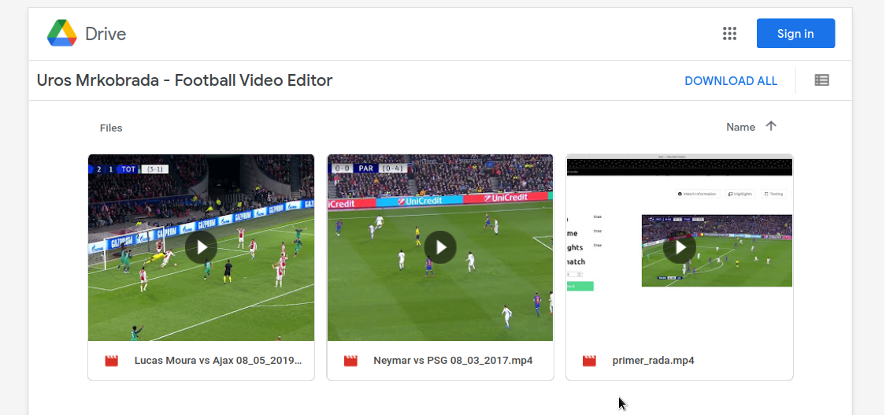

# **Football Video Editor Python**

### About project

This project is intended for people who make match compilations about football players. With this software as tool for editing you can make comps faster than using Sony Vegas Pro or other video editing software.

### How to start?  

There are two versions. One you can run in your browser and other as offline software. Choose one that you prefer.

1. Choose editing type  
2. Upload match  
3. Input start of halftime(from your source,for example match start at 12 minute and 20 seconds)  
4. Input moments when player is in focus(skill,goal,anything..),in highlights page type that and how long is that moment active (in seconds)  
5. Go to testing and see if everything is correct. You can also test specific timestamp of match to test source for highlights.  
6. If you passed test then you can start cutting and rendering.  
7. When rendering is over,just open that folder of highlights and compilation will be there.  
8. Enjoy!  


### Video demonstration

[](https://drive.google.com/drive/folders/1tHNHXy2myN_HzBPb9eRvhNYz0LSOQmVF)

### Requirements

1. Python
2. MongoDB
3. NodeJS
4. ffmpeg

### Offline version

```
git clone --single-branch --branch college https://github.com/uros-5/football-video-editor-python.git
cd offline
pip3 install -r requirements.txt
python3 main.py
```

### Web version

Create database in mongoDB with name videosb. Then create collection matchCompilations.

```
npm install
npm run serve
pip3 install -r requirements.txt
export FLASK_APP=app.py
flask run
```

Enjoy!

